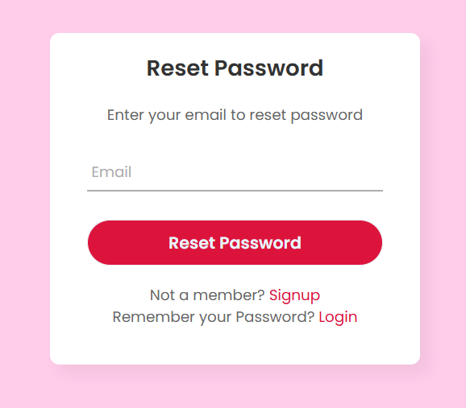

## Django Full Authentication Project

## Features :
- User Registration
- User Login
- Password Reset with Email Verification
- Session Management
- Secured Pages for Logged-in Users Only
- Custom User Feedback with Django Messages

##  Features in Detail
### User Registration

### User Login
- Registered users can log in using their username and password. Invalid credentials will prompt a feedback message.

###  Forgot Password
- Users can request a password reset by entering a valid registered email.
- A reset link will be sent to the provided email address.

### email sent msg
- Users can set a new password by following the link in the email.
- Once submitted, the password is updated, and the user can log in with the new credentials.

### Password Reset

- here we can reset our password

### admin panel
- Accessible only to admin users, the Django admin panel allows management of users, permissions, and other database models.

###  Secure Pages - login sucess
- After a successful login, users can access restricted pages available only to authenticated users.

## smith is user so smith can't access django admin panel
- Non-admin users, like Smith, cannot access the Django admin panel. A permission error will be displayed.
